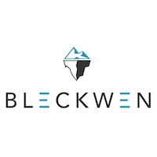

The LabCom FiT objective is to build tools for anomaly and fraud detection in financial transactions.

## Description

Financial crime is a very expensive plague slowing the digital society's advent.

La criminalité financière est un fléau dont le coût économique est colossal, et qui freine l’avènement
de la société numérique. Dans ce contexte, la lutte contre les fraudes, les usurpations d’identité, ou le blanchiment d’argent est un enjeu majeur. Elle repose sur l’analyse de séquences massives de transactions financières, afin d’y détecter des traces d’activités frauduleuses et de prendre les contre-mesures qui s’imposent. Toutefois, les progrès dans cette lutte sont entravés par un manque cruel de méthodes et d’outils pour modéliser et traiter les transactions de façon adéquate.

## Partners

 

     

    	
  	

  	

    	
  	

  	

    	
  	

	

    	
     

## News

TODO...

## Contacts

- Matthieu Latapy at *matthieu.latapy@lip6.fr*
- Nicolas Gensollen at *nicolas.gensollen@lip6.fr*

## Share



